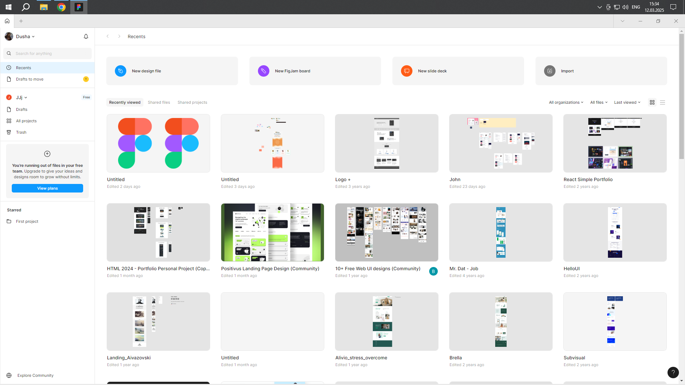

# ПЗ-1 Огляд сервісів для прототипування

Опрацювати теоретичний матеріал у прикріпленому документі. 

## 1. Створити обліковий запис  у сервісі Figma (вказати своє ім'я та прізвище).
## 2. Завантажити десктопну версію Figma на свій ПК чи ноутбук (по можливості) та встановити її.

