# “Дослідження кольорових гармоній та інструментів аналізу кольору в Adobe Color”

## Мета заняття
1. Ознайомити студентів із поняттям кольорової гармонії та основними типами
гармонії кольорів.
2. Навчити студентів використовувати колірне колесо для побудови палітр за різними
принципами гармонії.
3. Ознайомити із можливостями автоматичного виділення кольорових палітр із
зображень та створення градієнтів.
4. Навчити перевіряти контрастність кольорових пар відповідно до стандартів
доступності (WCAG).
5. Закріпити навички документування та аналізу роботи з кольором у
Markdown-форматі у GitHub-репозиторії.

## Практичне завдання
## 1. Робота з колірним колесом (Color Wheel)

### 1.1. Analogous
- **Скріншот:** 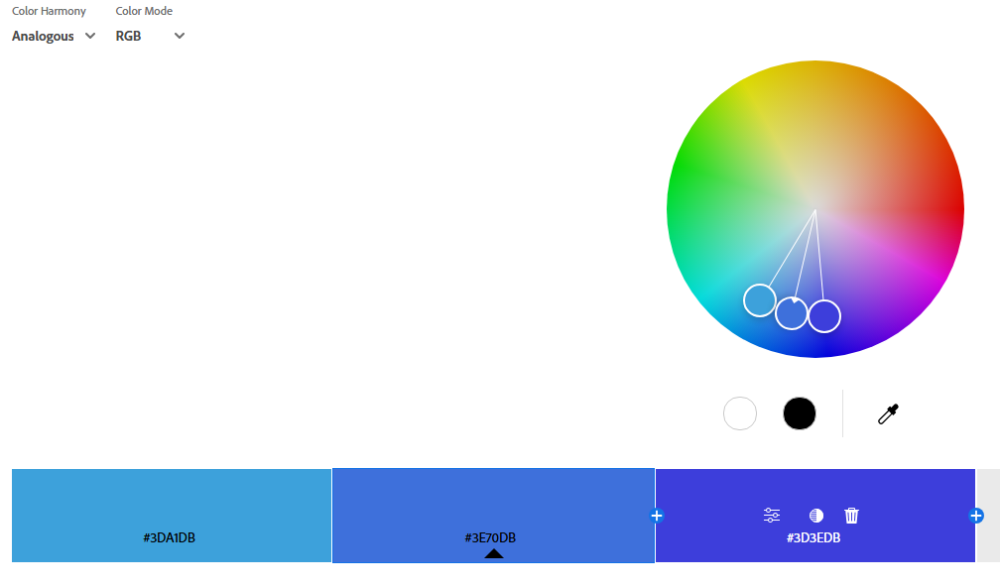
- **Тип гармонії:** Analogous
- **Базовий колір:** `#3498db`
- **Логіка:** Використано кольори, що знаходяться поруч з синім — це блакитний, синій та фіолетово-синій.
- **Емоційний ефект:** Палітра викликає відчуття гармонії, спокою та послідовності.

 ### 1.2. Monochromatic
- **Скріншот:** 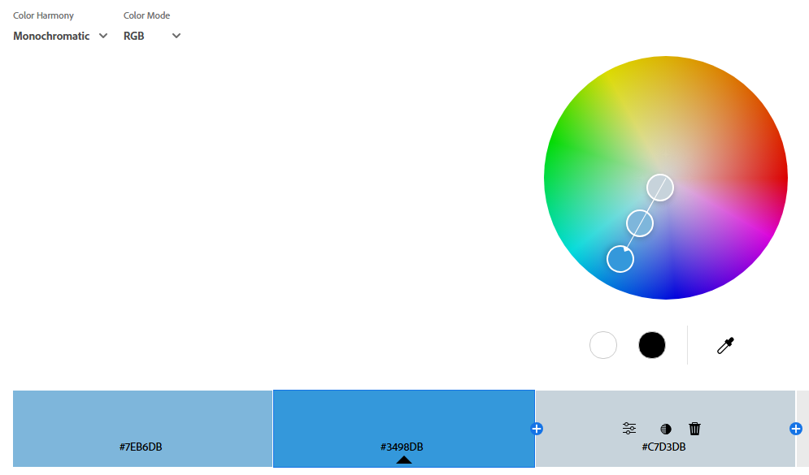
- **Тип гармонії:** Monochromatic
- **Базовий колір:** `#3498db`
- **Логіка:** Взято різні відтінки одного кольору — синього.
- **Емоційний ефект:** Спокій, чистота, єдність, мінімалізм.

### 1.3. Triad
- **Скріншот:** 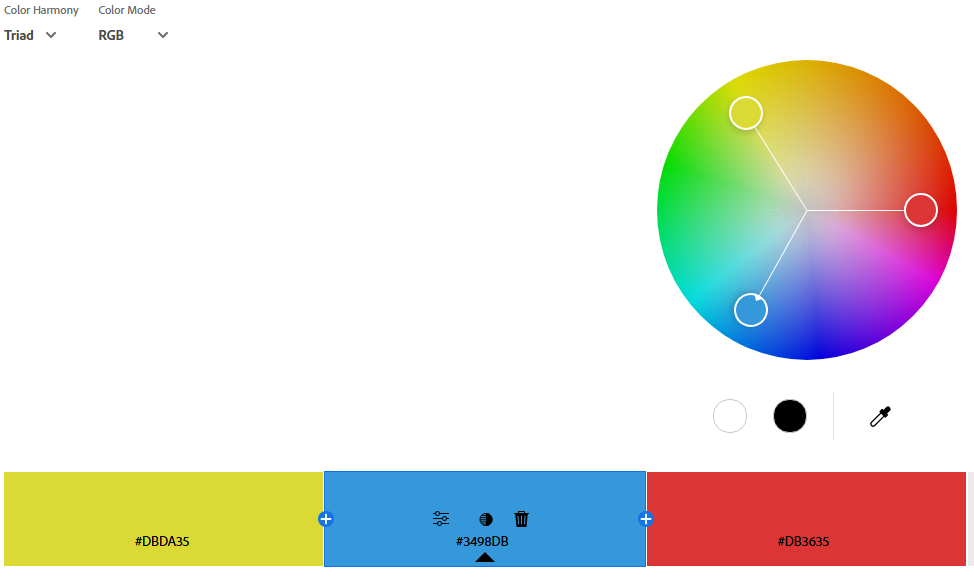
- **Тип гармонії:** Triadic
- **Базовий колір:** `#3498db`
- **Логіка:** Три кольори, розташовані на однаковій відстані на колі 
- **Емоційний ефект:** Контраст із балансом, яскравість, енергія.

### 1.4. Complementary
- **Скріншот:** 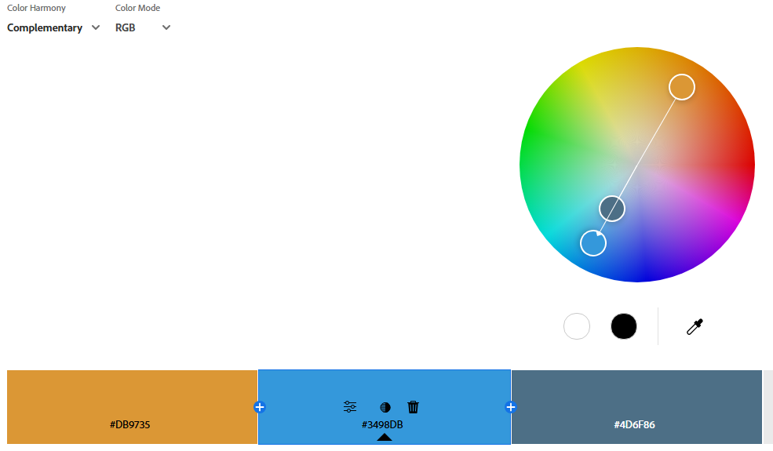
- **Тип гармонії:** Complementary
- **Базовий колір:** `#3498db`
- **Логіка:** Кольори, що знаходяться навпроти на колірному колесі 
- **Емоційний ефект:** Максимальний контраст, динаміка, привернення уваги.

### 1.5. Split Complementary
- **Скріншот:** 
- **Тип гармонії:** Split Complementary
- **Базовий колір:** `#3498db`
- **Логіка:** Основний колір + два кольори, що розташовані по обидві сторони від комплементарного.
- **Емоційний ефект:** Помірний контраст, балансоване збудження.

### 1.6. Square
- **Скріншот:** 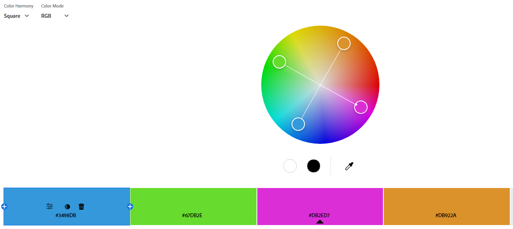
- **Тип гармонії:** Square
- **Базовий колір:** `#3498db`
- **Логіка:** Чотири кольори, розташовані на однаковій відстані на колі
- **Емоційний ефект:** Багатство кольору, різноманітність, жвавість.

### 1.7. Custom
- **Скріншот:** 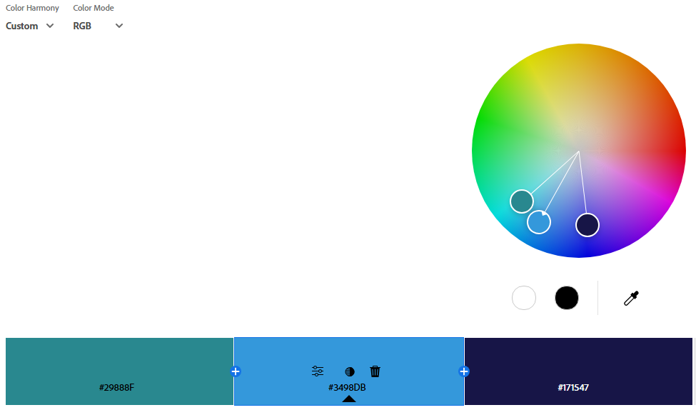
- **Тип гармонії:** Custom
- **Базовий колір:** `#3498db`
- **Логіка:** Користувацька палітра, створена вручну для певного естетичного або брендингового ефекту.
- **Емоційний ефект:** Унікальність, індивідуальність, стиль.

## 2. Створення палітри зображенням (Extract Theme)

### 1. Завантажте будь-яке зображення у розділ Extract Theme.
### 2. Створіть палітру у двох варіантах настрою:

#### Варіант Colorful
**Скріншот 1:**
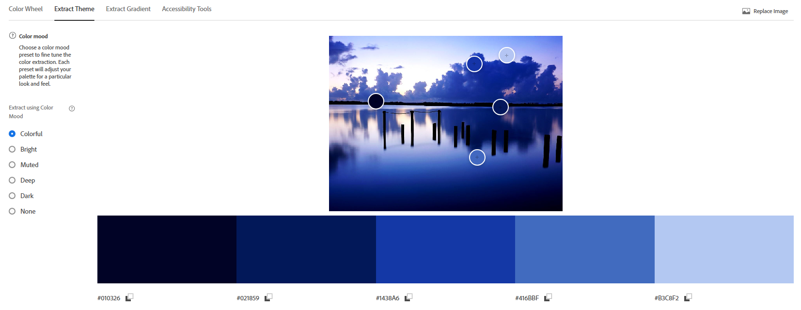

**Скріншот 2:**
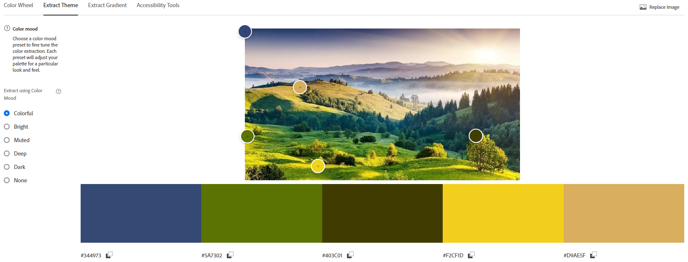

#### Варіант Muted
**Скріншот 1:**
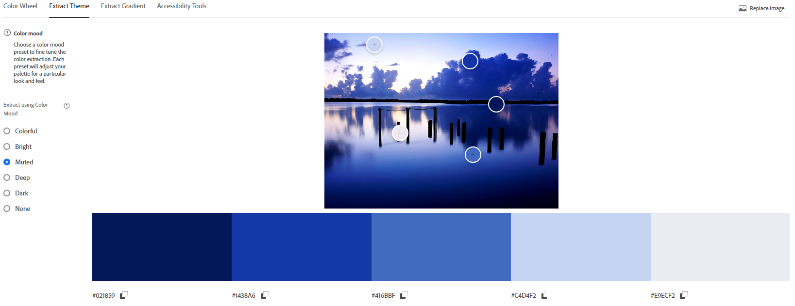

**Скріншот 2:**
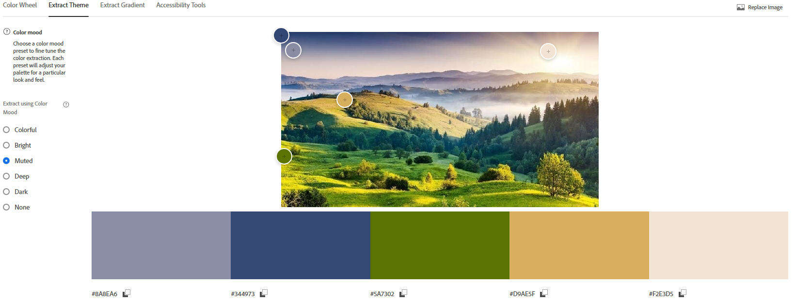

### Яка палітра більше підходить для інтерфейсу додатку? Чому?
Для інтерфейсу додатку більше підходить варіант "Muted".
Приглушені кольори менше відволікають користувача, покращують читабельність і створюють естетично витриманий інтерфейс, що особливо важливо для робочих і продуктивних додатків. Яскраві палітри ("Colorful") можуть бути корисними лише у специфічних випадках, де потрібна підвищена візуальна активність.

## 3.  Створення градієнту на основі зображення (Extract Gradient)

### 1 Завантажте те саме або інше зображення у розділ Extract Gradient.
### 2 Створіть градієнт з трьома кольоровими точками (Gradient Stops = 3).
### Збережіть скріншот побудованого градієнта.
**Скріншот:** 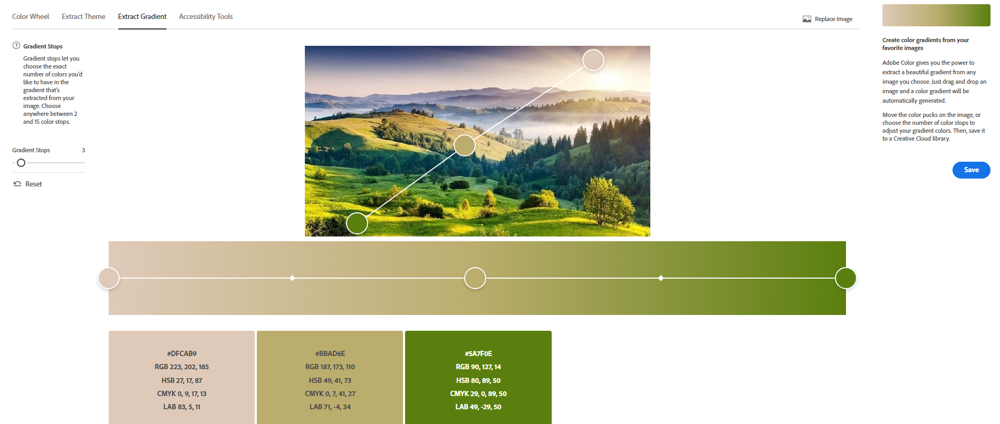

## 4. Аналіз контрасту (Accessibility Tools)

### Використовуючи будь-яку комбінацію кольорів із попередніх палітр:
- **Виберіть одну пару кольорів для тексту та фону.**
- **Перевірте контрастність у Accessibility Tools.**

### Зафіксуйте:

- **Рівень контрасту.**
- **Чи проходить ця пара перевірку для звичайного тексту (AA) і великого тексту (AAA). Якщо контраст недостатній — використайте запропоновану корекцію і збережіть скріншот.**

#### Варіант AA
**Скріншот:**
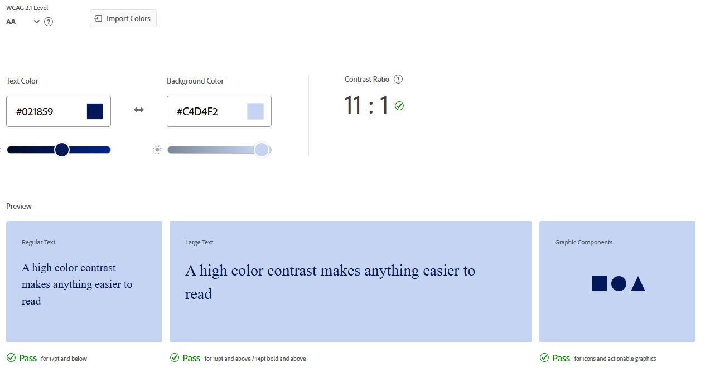

#### Варіант AAA
**Скріншот:**
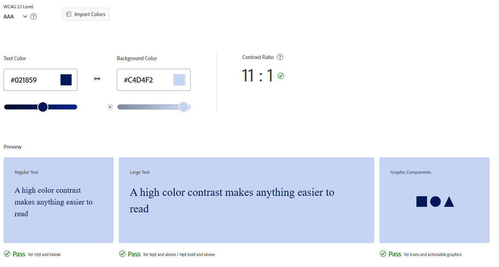

