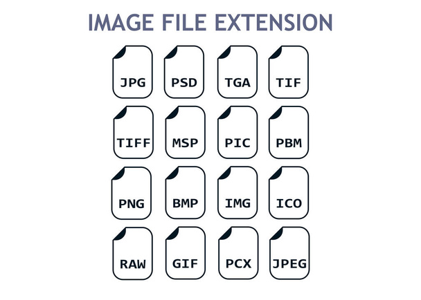

# Практичне заняття “Оптимізація зображень за допомогою Squoosh”

## 1. Аналіз вихідних файлів

**1. Виберіть 3 типи зображень (фотографія, скріншот, графічне зображення з текстом).**

### Фотографія (image1)

### Скріншот (image2)

### Графічне зображення з текстом (image3)

**2. Зафіксуйте їхній початковий розмір, формат (JPEG, PNG тощо) та вагу файлу**

| Зображення | Формат | Розмір    | Вага (КБ) |
|------------|--------|-----------|-----------|
| **image1** | JPEG   | 650 × 434 | 31.39     |
| **image2** | JPEG   | 954 × 473 | 464.72    |
| **image3** | SVG    | 608 × 434 | 49.47     |

## 2. Стиснення без втрати якості (lossless)

**3. Завантажте кожне зображення в Squoosh.**
**4. Використайте формати PNG (lossless) та WebP (lossless).**
**5. Зафіксуйте зміни у вазі файлу після кожного перетворення.**

| Зображення | Початковий розмір (КБ) | PNG (КБ)            | WebP (КБ)            |
|------------|------------------------|---------------------|----------------------|
| **image1** | 31.39                  | 300.45              | 196.22               |
| **image2** | 464.72                 | 607.98              | 410.06               |
| **image3** | 49.47                  | 607.98              | 410.06               |

**6. Переконайтеся, що якість зображення залишилася незмінною.**

- PNG значно збільшує вагу файлу.
- WebP показує кращу оптимізацію: він менший за PNG і навіть трохи легший за оригінальний JPEG.
- Якість залишилася незмінною, оскільки обидва формати підтримують стиснення без втрат.

## 3. Стиснення з втратою якості (lossy)

**7. Використайте формати MozJPEG, WebP (lossy) та AVIF.**
**8. Виконайте стиснення на рівнях якості 100%, 75% та 50%.**
**9. Зафіксуйте зміни розміру файлу.**

| MozJPEG    | 100% (КБ) | 75% (КБ)     | 50% (КБ) |
|------------|-----------|--------------|----------|
| **image1** | 94.5      | 25.8         | 17.4     |
| **image2** | 411       | 77.4         | 51.8     |
| **image3** | 75        | 18.8         | 13.5     |

| WebP       | 100% (КБ) | 75% (КБ)     | 50% (КБ) |
|------------|-----------|--------------|----------|
| **image1** | 73.4      | 21.1         | 15       |
| **image2** | 196       | 70.1         | 54.8     |
| **image3** | 35.4      | 12.6         | 10.4     |

| AVIF       | 100% (КБ) | 75% (КБ)     | 50% (КБ) |
|------------|-----------|--------------|----------|
| **image1** | 50.1      | 23.8         | 14.4     |
| **image2** | 233       | 92.3         | 53.2     |
| **image3** | 39.5      | 14.5         | 9.51     |

**10. Визначте мінімальний рівень якості, при якому зображення залишається прийнятним**

- Мінімальний рівень якості, при якому зображення залишається прийнятним, становить 75% для всіх форматів (MozJPEG, WebP, AVIF).

## 4. Оптимізація розміру відповідно до цільового використання

**11. Зменшіть розмір зображень відповідно до їхнього застосування:**
- Для вебу: максимальна ширина 1200 px.
- Для мобільних пристроїв: максимальна ширина 600 px.
- Для Retina-дисплеїв: створіть 2x або 3x версію зображення.

**12. Зафіксуйте зміни у вазі файлу після кожного етапу.**

| Зображення | Для вебу | Для мобільних пристроїв |  Для Retina-дисплеїв |
|------------|----------|-------------------------|----------------------|
| **image1** | 42 КБ    | 18.1 КБ                 | 44.3 КБ              |
| **image2** | 90.5 КБ  | 33.3 КБ                 | 150 КБ               |
| **image3** | 24.4 КБ  | 12.3 КБ                 | 27.7 КБ              |

## 5. Візуальний аналіз та висновки

**13. Порівняння вихідних та оптимізованих зображень**

Після оптимізації було помітно значне зменшення розміру файлів без суттєвої втрати якості. Формати WebP та AVIF показали кращу компресію порівняно з JPEG та PNG. Формат PNG без втрат значно збільшував вагу файлів, що робить його менш придатним для веб-оптимізації. Найкращі результати отримані при використанні AVIF, особливо для фотографій, а WebP є хорошим балансом між якістю та розміром файлу.

**14. Визначення найкращих форматів та параметрів оптимізації**

- Фотографії (image1): Найкращі результати дає AVIF, особливо на рівні якості 75%, оскільки забезпечує найменший розмір файлу при збереженні високої якості.

- Скріншоти (image2): WebP при 75% якості є оптимальним варіантом, оскільки добре передає деталі і зменшує вагу файлу.

- Графічні зображення з текстом (image3): WebP або AVIF при 75% якості ефективно зменшують розмір без суттєвої втрати чіткості тексту.

Під час виконання цієї практичної роботи було встановлено, що AVIF забезпечує найкраще стиснення для фотографій, тоді як WebP є оптимальним варіантом для зображень з текстом і скріншотів.

